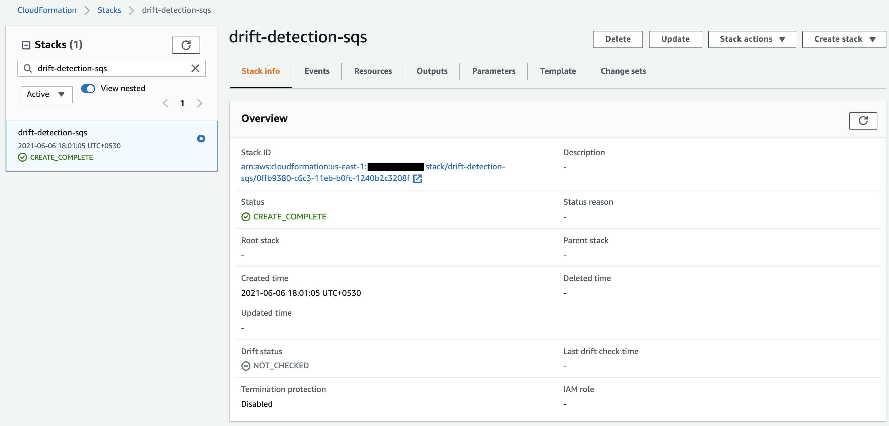
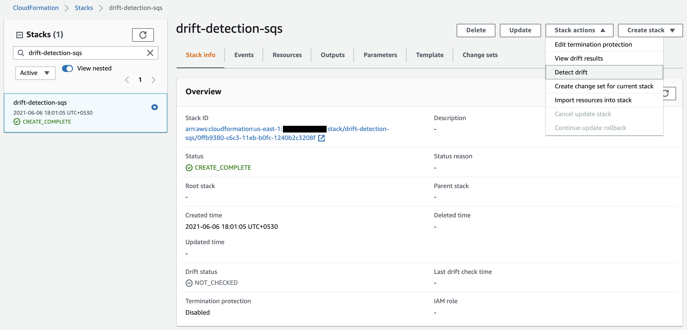
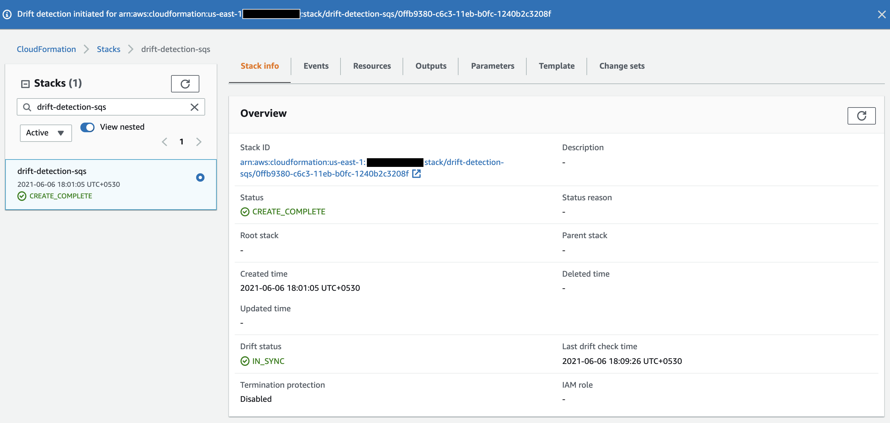
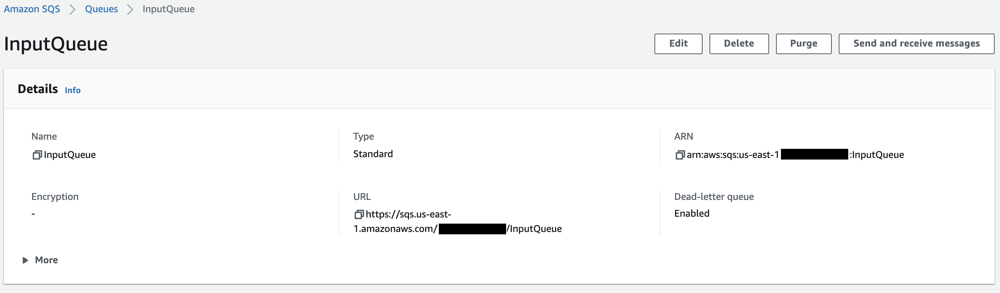

## Drift detection

**Introduction**

  - Drift detection allows to identify either a stack's actual configuration differs or has drifted, from its original deployed values. We can use CloudFormation to identify drift on an entire stack or resources within the stack
  - A resource is examined as drifted if its actual property values delta from the expected property values. This contains if the property or resource has been modified or deleted. A stack is considered to have drifted if one or more of its resources have drifted
  - CloudFormation identity drift on the AWS resources that support drift detection. Resources that don't support drift detection are tagged a drift status of **NOT_CHECKED**. Drift detection supports the following statuses: **CREATE_COMPLETE, UPDATE_COMPLETE, UPDATE_ROLLBACK_COMPLETE, and UPDATE_ROLLBACK_FAILED**. When identifying drift on a stack, CloudFormation fails to detect drift on any nested stacks that belong to that stack

      
 
 - In the below section, we will deploy a CloudFormation stack and intentionally make drift to its resources via AWS Consoles to understand the different types of changes using the Drift Detection feature
 
    1. Traverse to the <a href="https://console.aws.amazon.com/cloudformation/">AWS CloudFormation</a> and Click on the Create Stack option on the right

        

    2. Next we will upload the template via an S3 bucket or upload it from the local machine, in this lab we will select the local upload method, please download the template from this <a href="https://github.com/sanchitdilipjain/cloudformation-drift-detection/blob/main/cloudformation.json">link</a> and upload it to the AWS console
    
        
    
    3. After providing the template file, click Next. Now, provide Stack Name and click Next
    
        
    
    4. Now we will in the Configure stack options section, leave everything as default, and click Next
    
    5. Next in the review section, verify the details provided and click Create Stack
    
    6. Post the stack completion you will get status as CREATE_COMPLETE as shown below  
    
        
    
    7. After the stack deployment is complete, the Drift status column will show NOT_CHECKED.
    
        
    
    8. Next, choose the CloudFormation Stacks view, click Actions and Detect drift, then click Yes to confirm the drift detection operation as shown below
    
        
         
    9. A dialog box with the progress of the asynchronous drift operation will be rendered. When complete, the dialog will inform that the stack is IN_SYNC.
    
        
        
        **Note:** At this stage the stack is IN_SYNC state now, will we simulate a scenario that will lead the template’s definition of resources to deviate from its actual state.
    
    10. Traverse to the <a href="https://console.aws.amazon.com/sqs/">AWS SQS</a> and select on the sqs we deployed above
    
        
    
    11. Make the below changes to the queue:

        - Reset Default Visibility Timeout to 50.
        
        - Reset Delivery Delay to 120.
        
        - Uncheck the dead-letter queue option to remove the redirection of the failed message to the DLQ SQS.
        
        - Click Save Changes.
        
        **Note:** We have now made a modification in the value of an existing property, added a new property, and deleted an existing property of the resource
     
     12. Traverse back to the <a href="https://console.aws.amazon.com/cloudformation/">AWS CloudFormation</a>
     
     13. Choose the CloudFormation Stacks view, click Actions and Detect drift, then click Yes to confirm the drift detection operation as shown below
    
         
     
     14. A dialog box with the progress of the asynchronous drift operation will be rendered. When complete, the dialog will inform that the stack is DRIFTED.
    
         
     
     15. Select on View details link on the dialog
     
     16. Under the Resource drift status section, check the drift status for DeadLetterQueue is IN_SYNC since no changes were made. However, the status for InputQueue is MODIFIED as the properties specified in the stack’s template do not match the live state of the resource
     
         
     
     17. Click to expand InputQueue. On the ride side, under Differences, click Select all. Note that this will highlight the differences in the template.
      
         
         
         
      
      **Note:** The idea behind the Drift Detection feature is to compare the delta between the resources and their properties as specified in the cloudformation template versus its current value. Properties that are not part of the template will not be included in the drift status for the resource. In the above example, the update to the property Delivery Delay will not be reflected as the property is not mentioned in the template.
        

